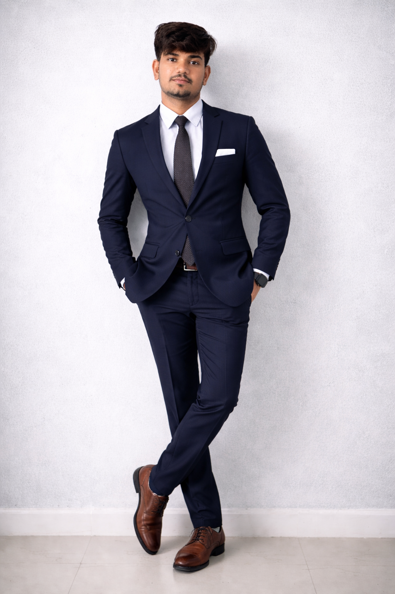

# UI/UX Design Audit & Redesign Recommendations
## Portfolio: P. Sumanth Reddy — AI Solutions Specialist

---

## Executive Summary

This portfolio currently uses a **hand-built custom CSS system** on the landing page and **Tailwind CSS (Play CDN)** on three project sub-pages, resulting in two visually distinct design systems that do not share colors, typography, or component patterns. The site is feature-rich with animations and interactions but suffers from inconsistent branding, accessibility gaps, and several placeholder/unstyled artifacts.

**Priority improvements:**
1. Unify the design system across all pages
2. Establish a proper spacing, typography, and color scale
3. Replace excessive emoji decoration with consistent iconography
4. Fix bugs (nested footer, copy-paste text, missing form ID)
5. Improve WCAG contrast ratios and accessibility

---

## 1. Layout & Sections

### Current Issues
- **Excessive padding:** Sections use `padding: 120px 0`, which creates enormous vertical gaps on desktop. The hero alone consumes ~300px of vertical space before content begins.
- **Inconsistent container widths:** The `.container` uses `width: 90%` with `max-width: 1200px`, while project pages use Tailwind's `container mx-auto` (effectively 100% width with internal padding). This creates visual inconsistency.
- **Weak section grouping:** The hero, about, and services sections all have similar background treatments (gradient purple variations), making it hard to distinguish content blocks.
- **Projects grid ambiguity:** The "Video Highlights" grid and "Project Deep Dives" grid are back-to-back with minimal visual separation, causing cognitive load.
- **Commented-out content:** Education and Skills sections are present in HTML but commented out, leaving dead code and confusing the DOM structure.

### Design Principles
- **Gestalt Principle of Proximity:** Related elements should be grouped closer together; unrelated elements should have more separation. White space is an active design element, not empty space.
- **Visual Hierarchy:** Users scan in an F-pattern. Critical content (value proposition, CTAs) should be in the top-left quadrant, with clear section dividers.
- **Progressive Disclosure:** Reveal complexity gradually. Don't show everything at once.

### Recommendations
1. **Reduce section padding to a consistent 8-unit scale:**
   - Desktop: `padding: 6rem 0` (96px)
   - Tablet: `padding: 4rem 0` (64px)
   - Mobile: `padding: 3rem 0` (48px)
   - Hero can remain slightly larger at `padding: 8rem 0 6rem` (128px top, 96px bottom)

2. **Standardize container max-width:**
   - Use `max-width: 1200px` consistently across all pages
   - Use `padding: 0 clamp(1rem, 4vw, 3rem)` for fluid side spacing

3. **Introduce section dividers:**
   - Add subtle `<hr>` elements or gradient dividers between major sections
   - Use alternating background colors (`#ffffff` → `#fafafa` → `#ffffff`) to create visual rhythm

4. **Remove commented-out HTML:**
   - Delete the Education and Skills commented sections entirely
   - Keep content in version control, not in the live DOM

5. **Projects section restructure:**
   - Add a clear visual separator between "Video Highlights" and "Project Deep Dives"
   - Consider a tabbed interface or a horizontal rule with a label

---

## 2. Typography

### Current Issues
- **Three fonts loaded unnecessarily:** `Poppins` (body), `Montserrat` (headings on index), `Inter` (body on sub-pages), `Fira Code` (code on sub-pages). Four font families create loading overhead and visual inconsistency.
- **No typographic scale:** Font sizes are set ad-hoc with `clamp()` but lack a coherent modular scale. The hero `h1` uses `clamp(2rem, 5vw, 3.8rem)` while section titles use `clamp(1.8rem, 4vw, 2.8rem)`.
- **Inconsistent line heights:** Body text uses `line-height: 1.6` on index but `1.8` in some overridden inline styles.
- **Poor heading-to-body contrast:** Headings and body text are too close in weight/size, reducing hierarchy.

### Design Principles
- **Modular Scale:** Use a mathematical ratio (e.g., 1.25 — Major Third) to derive all type sizes from a base. This creates harmonious proportions.
- **Type Scale (WCAG):** Body text should be 16px minimum (1rem). Line height should be 1.5–1.75 for readability. Headings need 1.2–1.3 line height.
- **Font Loading Performance:** Limit to 2 font families maximum. Use `font-display: swap` to prevent FOIT (Flash of Invisible Text).

### Recommendations
1. **Unified font pairing:**
   - **Primary:** `Inter` (400, 500, 600, 700) — for all body text, UI elements, and subheadings. It's highly legible on screens and already used on sub-pages.
   - **Display:** `Plus Jakarta Sans` (600, 700, 800) — for hero headings, section titles, logo. It has a distinctive, modern character that pairs well with Inter.
   - Remove `Poppins` and `Montserrat` to reduce font loading from ~200KB to ~80KB.

2. **Modular type scale (base 16px, ratio 1.25):**
   | Level | Size | Usage |
   |-------|------|-------|
   | xs | 0.75rem (12px) | Captions, labels, metadata |
   | sm | 0.875rem (14px) | Small text, helper text |
   | base | 1rem (16px) | Body text |
   | lg | 1.125rem (18px) | Large body, lead text |
   | xl | 1.25rem (20px) | H4, card titles |
   | 2xl | 1.5rem (24px) | H3 |
   | 3xl | 1.875rem (30px) | H2 |
   | 4xl | 2.25rem (36px) | H1 desktop |
   | 5xl | 3rem (48px) | Hero headline desktop |
   | 6xl | 3.75rem (60px) | Hero headline large |

   Implementation:
   ```css
   :root {
       --text-xs: 0.75rem;
       --text-sm: 0.875rem;
       --text-base: 1rem;
       --text-lg: 1.125rem;
       --text-xl: 1.25rem;
       --text-2xl: 1.5rem;
       --text-3xl: 1.875rem;
       --text-4xl: 2.25rem;
       --text-5xl: 3rem;
       --text-6xl: 3.75rem;
   }
   ```

3. **Line height scale:**
   - Headings: `1.2`
   - Body: `1.6`
   - Lead text: `1.5`

4. **Font weight discipline:**
   - Regular body: 400
   - Emphasized text: 500
   - Subheadings: 600
   - Headings: 700
   - Hero/Display: 800

5. **Remove inline font styles:**
   - All inline `style="font-size: ..."` and `style="font-weight: ..."` must be extracted into CSS classes

---

## 3. Visual Assets

### Current Issues
- **Inconsistent imagery:** The hero uses no imagery (emoji only), About uses `photo.png`, Projects use videos for the top 3 and text-only cards for deep dives. Four PNG screenshots exist but are unused.
- **No consistent image treatment:** Images lack uniform border radius, shadow, or aspect ratio standards.
- **Videos as primary project assets:** Autoplaying muted videos in a grid can be distracting and don't work well on mobile data connections.
- **No hero visual:** The landing page hero is text-only with a waving emoji, which feels dated compared to modern portfolios that use abstract shapes, subtle 3D elements, or photography.

### Design Principles
- **Fitts's Law:** Larger, closer targets are easier to interact with. Visual assets should guide attention to CTAs.
- **Hick's Law:** Too many visual choices increase decision time. Limit imagery styles to 2–3 consistent treatments.
- **Performance:** Large unoptimized images hurt Core Web Vitals. Use modern formats (WebP/AVIF), lazy loading, and appropriate sizing.

### Recommendations
1. **Establish 3 image treatments:**
   - **Portrait/About:** Rounded corners (`border-radius: 1rem`), subtle shadow (`0 20px 40px rgba(0,0,0,0.08)`), 4:3 or 1:1 aspect ratio. Hover: gentle scale + shadow increase.
   - **Project cards:** 16:9 aspect ratio, `object-fit: cover`, gradient overlay on hover, rounded top corners only.
   - **Tech/icon assets:** Consistent 48x48 or 64x64 square, centered, no border.

2. **Hero section upgrade:**
   - Replace the waving emoji with a subtle CSS-generated abstract shape or a low-opacity geometric pattern.
   - Alternatively, use a tasteful gradient mesh background (CSS-only) that feels premium without loading images.

3. **Video optimization:**
   - Add `poster` attributes to all `<video>` tags with a lightweight thumbnail (can be generated from the video or a static image).
   - Disable autoplay on mobile (use `playsinline` but not `autoplay`) to save bandwidth.
   - Consider replacing the video grid with a carousel or a single featured video + image cards.

4. **Use the existing PNG screenshots:**
   - Reference `Ai_code_editor.png`, `agentic_ai_chatbot.png`, and chatbot PNGs in the Project Deep Dive cards as hover-reveal images or card headers.

5. **Lazy loading:**
   ```html
   
   ```

---

## 4. Iconography & Emojis

### Current Issues
- **Emoji overuse:** 20+ emojis are used as decorative elements (👋, 🚀, 💼, ✓, 💰, 🎯, 🛠, ⭐, 📂, 🏢, 📅, 💻, 🤖, ❤️, ⚡, 🌍). This creates a casual, unprofessional aesthetic and breaks cross-platform consistency.
- **Mixed icon systems:** Font Awesome 6.4.0 is used for functional icons (navigation, social, form), while emojis are used for decoration. There's no clear boundary between the two.
- **Inconsistent emoji sizing:** Emojis used as `::before` pseudo-elements have no consistent sizing or alignment.

### Design Principles
- **Semiotic Consistency:** Icons should have consistent meaning. If a rocket means "projects," it should not also mean "hire me" or "start your project."
- **Accessibility:** Emojis have varying screen reader support. Decorative emojis should have `aria-hidden="true"`. Font Awesome icons should have `aria-label` or be inside elements with accessible text.
- **Aesthetic Cohesion:** Line icons (Font Awesome regular) feel lighter and more modern for UI. Solid icons (Font Awesome solid) work for CTAs and emphasized elements.

### Recommendations
1. **Replace decorative emojis with CSS-generated visual markers:**
   - Remove all decorative emojis from headings, cards, and section titles.
   - Use Font Awesome icons exclusively for both functional and decorative purposes.

2. **Icon style guide:**
   - **Navigation & UI:** `fa-regular` (line style) — lighter, cleaner
   - **Cards & CTAs:** `fa-solid` — stronger visual weight
   - **Social & Brand:** `fa-brands` — platform-native feel
   - **Size discipline:**
     - Inline with text: `1em` (inherits font size)
     - Card icons: `2rem` (32px)
     - Feature icons: `2.5rem` (40px)
     - Hero/CTA icons: `3rem` (48px)

3. **Specific replacements:**
   | Emoji | Replacement | Location |
   |-------|-------------|----------|
   | 👋 hero | Remove or replace with subtle CSS animation | Hero headline |
   | 🚀 project cards | `fa-solid fa-rocket` (or remove) | Project cards |
   | 💼 about | `fa-solid fa-briefcase` | About section |
   | ✓ list items | `fa-solid fa-check` | All bullet lists |
   | 💰 ROI | `fa-solid fa-chart-line` | About ROI block |
   | 🎯 why me | `fa-solid fa-bullseye` | About heading |
   | 🛠 tech stack | `fa-solid fa-wrench` | About tech list |
   | ⭐ services title | Remove | Section titles |
   | 📂 AI solutions | `fa-solid fa-lightbulb` | Services grid |
   | 🏢 experience | `fa-solid fa-building` | Experience |
   | 📅 date | `fa-regular fa-calendar` | Experience dates |
   | 💼 role | `fa-solid fa-user-tie` | Experience roles |
   | ❤️ footer | Remove | Footer |
   | ⚡ footer | `fa-solid fa-bolt` | Footer (if needed) |
   | 🌍 footer | `fa-solid fa-globe` | Footer |
   | 💻 code editor | `fa-solid fa-code` | Project page hero |
   | 🤖 chatbot | `fa-solid fa-robot` | Project page hero |

4. **Accessibility additions:**
   - Add `aria-hidden="true"` to all decorative icons
   - Ensure all interactive icons (hamburger, social links) have accessible names
   - Use `<span class="sr-only">Menu</span>` alongside hamburger icon

---

## 5. Color & Styling

### Current Issues
- **Purple/gold/pink palette is dated:** The current palette (`#6A0572`, `#FFD700`, `#E91E63`) screams "2015 SaaS landing page." Modern design trends favor more restrained, sophisticated palettes.
- **WCAG contrast failures:**
  - `#757575` (gray) on `#F8F0FC` (light) has a contrast ratio of ~2.8:1 (fails WCAG AA which requires 4.5:1)
  - `#E91E63` (accent pink) on white has ~3.5:1 (fails for normal text, passes for large text only)
  - Gold `#FFD700` on white has ~1.8:1 (fails completely)
- **Inconsistent gradients:** Buttons use three different gradients (blue-purple, pink, black) that don't relate to the brand palette.
- **Excessive shadows:** Cards use `box-shadow: 0 20px 40px rgba(0,0,0,0.1)` which is heavy for a light-themed site.
- **Border radius inconsistency:** Cards use `border-radius: 15px`, `20px`, `12px`, `8px` — no standard scale.

### Design Principles
- **60-30-10 Rule:** 60% dominant color, 30% secondary, 10% accent. This creates balanced, professional palettes.
- **WCAG 2.1 AA:** Normal text needs 4.5:1 contrast ratio. Large text (18px+ or 14px+ bold) needs 3:1.
- **Color Psychology:** Purple conveys creativity/tech but can feel cold. Warm neutrals with a single vibrant accent feel more premium and trustworthy.
- **Reduced Motion:** Respect `prefers-reduced-motion` for users with vestibular disorders.

### Recommendations
1. **New refined palette (Dark Indigo + Warm Neutral + Vibrant Teal):**

   | Token | Hex | Role | Contrast on White |
   |-------|-----|------|-------------------|
   | `--primary` | `#4F46E5` | Indigo 600 — brand, headings, links | 8.6:1 ✓ |
   | `--primary-dark` | `#3730A3` | Indigo 800 — hover, active states | 12.6:1 ✓ |
   | `--primary-light` | `#EEF2FF` | Indigo 50 — subtle backgrounds | — |
   | `--secondary` | `#0D9488` | Teal 600 — secondary accent, success | 4.6:1 ✓ |
   | `--accent` | `#F59E0B` | Amber 500 — callouts, highlights | 3.1:1 (large text only) |
   | `--dark` | `#111827` | Gray 900 — primary text | 16.1:1 ✓ |
   | `--gray` | `#6B7280` | Gray 500 — secondary text | 5.4:1 ✓ |
   | `--light` | `#F9FAFB` | Gray 50 — page background | — |
   | `--light-gray` | `#E5E7EB` | Gray 200 — borders | — |
   | `--white` | `#FFFFFF` | Card backgrounds | — |

   **Rationale:** Indigo is the current color of AI/tech (used by Vercel, Next.js, Linear). Teal provides a fresh, trustworthy secondary. Amber adds warmth without the dated gold feel.

2. **Gradient standardization:**
   - Primary gradient: `linear-gradient(135deg, #4F46E5, #7C3AED)` — indigo to violet
   - Secondary gradient: `linear-gradient(135deg, #0D9488, #14B8A6)` — teal
   - Remove pink (`#f093fb → #f5576c`) and blue-purple (`#667eea → #764ba2`) gradients entirely
   - Use subtle opacity-based backgrounds instead of colorful gradients for cards

3. **Shadow scale:**
   ```css
   --shadow-sm: 0 1px 2px rgba(0,0,0,0.05);
   --shadow-md: 0 4px 6px -1px rgba(0,0,0,0.1), 0 2px 4px -2px rgba(0,0,0,0.1);
   --shadow-lg: 0 10px 15px -3px rgba(0,0,0,0.1), 0 4px 6px -4px rgba(0,0,0,0.1);
   --shadow-xl: 0 20px 25px -5px rgba(0,0,0,0.1), 0 8px 10px -6px rgba(0,0,0,0.1);
   ```
   Use `--shadow-lg` for cards, `--shadow-md` for inputs/buttons, `--shadow-sm` for subtle lifts.

4. **Border radius scale:**
   ```css
   --radius-sm: 0.375rem;  /* 6px — tags, badges */
   --radius-md: 0.5rem;    /* 8px — inputs, small cards */
   --radius-lg: 0.75rem;   /* 12px — cards, modals */
   --radius-xl: 1rem;      /* 16px — hero cards, large containers */
   --radius-2xl: 1.5rem;   /* 24px — image containers, modals */
   --radius-full: 9999px;  /* pills, avatars */
   ```

5. **Micro-interactions:**
   - **Hover lift:** Cards lift 4–8px with shadow increase. Duration: `200ms ease-out`.
   - **Button press:** Scale down to `0.97` on `:active`. Duration: `100ms`.
   - **Focus rings:** Use `outline: 2px solid var(--primary); outline-offset: 2px;` for keyboard navigation. Never remove outlines without replacement.
   - **Smooth transitions:** Use `transition: all 0.2s cubic-bezier(0.4, 0, 0.2, 1)` as the default. The current `0.4s cubic-bezier(0.175, 0.885, 0.32, 1.275)` is too bouncy for professional interfaces.

6. **Reduced motion:**
   ```css
   @media (prefers-reduced-motion: reduce) {
       * {
           animation-duration: 0.01ms !important;
           animation-iteration-count: 1 !important;
           transition-duration: 0.01ms !important;
       }
   }
   ```

7. **Dark mode preparation (optional but recommended):**
   Add CSS custom properties for dark mode values. Even if not implemented now, it future-proofs the codebase.

---

## 6. Implementation Roadmap

### Phase 1: Foundation (High Priority)
- [ ] Extract all inline styles into CSS classes in `index.html`
- [ ] Replace current `:root` variables with the new design token system
- [ ] Implement the unified typography scale
- [ ] Replace all decorative emojis with Font Awesome icons
- [ ] Fix the nested footer bug (lines 2735–2744)
- [ ] Remove all commented-out HTML sections
- [ ] Standardize container widths and section padding

### Phase 2: Visual Polish (Medium Priority)
- [ ] Apply new color palette to all components
- [ ] Update shadow and border-radius scales
- [ ] Refine micro-interactions and transition timings
- [ ] Add `prefers-reduced-motion` support
- [ ] Optimize video assets with poster images
- [ ] Replace video grid with hybrid image+video layout

### Phase 3: Cross-Page Unification (Medium Priority)
- [ ] Migrate `index.html` to use the same base styles as sub-pages, OR migrate sub-pages to use the same custom CSS as `index.html`
- [ ] Standardize header/nav across all pages
- [ ] Fix copy-paste footer bug on all sub-pages
- [ ] Fix swapped section headings in `agentic-AI-Chatbot.html`
- [ ] Remove AI-assistant planning comments from sub-pages

### Phase 4: Accessibility & Performance (High Priority)
- [ ] Audit and fix all contrast ratios to WCAG AA
- [ ] Add `aria-label`, `aria-hidden`, and `sr-only` text to all icons
- [ ] Add `loading="lazy"` to all images
- [ ] Replace Tailwind Play CDN with a built stylesheet on sub-pages
- [ ] Add `font-display: swap` to Google Fonts URLs
- [ ] Configure actual Formspree ID for contact form

---

## 7. Developer Implementation Notes

### CSS Architecture
Move from a single 2000-line `<style>` block to a layered approach:

```css
/* 1. Reset & Base */
/* 2. Design Tokens (variables) */
/* 3. Typography Scale */
/* 4. Layout (container, grid, section) */
/* 5. Components (buttons, cards, forms, nav) */
/* 6. Utilities (spacing, text, visibility) */
/* 7. Animations */
/* 8. Responsive (mobile-first breakpoints) */
```

### Naming Convention
Adopt BEM (Block Element Modifier) for class names:
```css
.card { }
.card__image { }
.card__content { }
.card--featured { }
.card--hover-lift:hover { }
```

### Accessibility Checklist
- [ ] All images have descriptive `alt` text
- [ ] All form inputs have associated `<label>` elements
- [ ] Color is not the only indicator of state (add icons/text alongside color changes)
- [ ] Interactive elements are keyboard accessible
- [ ] Page has logical heading hierarchy (h1 → h2 → h3, no skipping)
- [ ] Page has a `<main>` landmark and skip-to-content link

### Performance Targets
- First Contentful Paint: < 1.5s
- Largest Contentful Paint: < 2.5s
- Cumulative Layout Shift: < 0.1
- Total font file size: < 150KB
